  

    
    
    
    <wbr>
    
    <!--
    
    -->
  

  <strong>
    You can call me Anderson, a software engineer who loves learning, sharing, hacking, and gamified stuff.
  </strong>

- I'm **#OpenToWork** and available to relocate!
- Located in Brazil :brazil:
- Currently stepping more into Engineering Leadership and DevSecOps.
- Software engineer since 2019 in full-stack development
- Penetration tester with experience in the AppSec world
- I love a freshly brewed cup of coffee! :coffee:

 

---

### Projects 
<!-- ### Main projects -->

#### Security Projects

###### * [🐐 Security Goat](https://github.com/andersonbosa/security-goat): Helps protect your applications on GitHub by blocking pipelines with security vulnerabilities detected by Dependabot.

###### * [🔎 Wayback.go](https://github.com/andersonbosa/wayback.go/tree/main): Golang tool simplifies Wayback Machine search on multiple targets, allowing users to search archived web pages with ease.

#### IA Projects (built with/related to IA)

###### * [👷‍♀️ Gu IA Assistant](https://github.com/andersonbosa/guia-cli): Gu, is a simple IA agent that specializes in software engineering, aiding in coding tasks and providing technical guidance.

<!-- #### Web projects -->

<!-- #### CLI Projects -->

<!-- #### IoT Projects -->

#### Others

###### * [🐚 Moshell.sh](https://github.com/andersonbosa/moshell.sh): Moshell.sh makes it easy to add and maintain shell customizations, allowing users to create and manage their own repository of customizations.

###### * [🛳️ Droxy](https://github.com/andersonbosa/droxy): Droxy automates the setup of SOCKS5 tunnels via SSH, simplifying communication between Docker containers and applications on different networks.

###### * [🌳 Tri.go](https://github.com/andersonbosa/tri): This application is a simple "To-do Manager". It is a CLI written in Golang created to get introduced to the language and good CLI practices.

###### * [🔎 GitAudit.go](https://github.com/andersonbosa/git_audit_go): Extract commit data from Git log to CSV. Includes hash, timestamp, and author details. Helps analyze activity patterns and improve team efficiency.

###### * [🍨 IsCreamRecord.py](https://github.com/andersonbosa/IsCreamRecord.py): Tool for collecting image data from computer screen or live camera feed.

###### * [🚙 car-speed-tracking.py](https://github.com/andersonbosa/car-speed-tracking): Simple application of how to use the "OpenCV" python module to track an object in real-time from a video source.

###### * [🧑‍🎓 finger-counter.py](https://github.com/andersonbosa/finger-counter-py): Studies on how to perform "object position detection" so that I can use in another (secret muahaha) project.

###### *[🏃‍♀️ Run Stremio, Run!!](https://github.com/andersonbosa/run-stremio-run): simple web application that allows users to connect their local Stremio Server to Stremio Web to watch what they want.

###### * [🦸 API Consumer](https://github.com/andersonbosa/superhero-consumer): It's an API that cache responses from SuperHeroAPI. The main objective was to implement an API with the ability to search and cache another API.

<!-- hidden section >:D

#### Playgrounds/Learnings

These are environments that I created to facilitate my study of some concepts/technology in question.

* https://github.com/andersonbosa/ctfs
* https://github.com/andersonbosa/learning-terraform
* https://github.com/andersonbosa/github-actions-learn
* https://github.com/andersonbosa/playground-crewai
* https://github.com/andersonbosa/playground-rabbitmq
* https://github.com/andersonbosa/playground-clojure
* https://github.com/andersonbosa/playground-ruby

#### To organize and add to my portfolio

* https://github.com/andersonbosa/violentScripts
* https://github.com/andersonbosa/khathuram-csv-search-upload
* https://github.com/andersonbosa/finance-api-expressjs
* https://github.com/andersonbosa/tic-tac-toe-react
* https://github.com/andersonbosa/react-chat-app
* https://github.com/andersonbosa/calc-app
* https://github.com/andersonbosa/front-end-utils/

-->

 

---

### Publications

<!-- BLOG-POST-LIST:START -->
- [LGPD para devs](https://dev.to/t4inha/lgpd-para-devs-mk0)
- [The &quot;Something else&quot; option in Linux installation](https://dev.to/t4inha/the-something-else-option-in-linux-installation-1c54)
- [Revolutionizing Git Workflow: My Experience with aicommits](https://dev.to/t4inha/my-experience-with-aicommits-794)
- [How to use nodemon with VSCode debugger?](https://dev.to/t4inha/how-to-use-nodemon-with-vscode-debugger-2bpa)
- [O poder por trás do terminal Linux](https://dev.to/t4inha/o-poder-por-tras-do-terminal-linux-2m63)
- [The power behind the Linux terminal](https://dev.to/t4inha/the-power-behind-the-linux-terminal-189h)
<!-- BLOG-POST-LIST:END -->

 

---

### Tech's I worked with:

  <!-- Languages -->
  &nbsp;
  &nbsp;
  &nbsp;
  &nbsp;
  &nbsp;
  &nbsp;
  &nbsp;
  &nbsp;
  &nbsp;
  &nbsp;
  &nbsp;

  <!-- Frameworks -->
  &nbsp;
  &nbsp;
  &nbsp;
  &nbsp;
  &nbsp;
  <!-- Databases -->
  &nbsp;
  &nbsp;
  &nbsp;
  &nbsp;

  <!-- Development Tools -->
  &nbsp;
  &nbsp;
  &nbsp;
  &nbsp;
  &nbsp;
  &nbsp;
  <!-- DevOps -->
  &nbsp;
  &nbsp;
  &nbsp;

  <!-- Tools -->
  &nbsp;
  &nbsp;
  &nbsp;
  &nbsp;
  <!-- Clouds/Cloud techs -->
  &nbsp;
  &nbsp;
  <!-- Any -->
  &nbsp;
  &nbsp;

 

<!--
---
### Cool statistics

 

-->

---

  Feel free to <a href="#badges">contact</a> me for consulting or an interesting discussion,
  I would love to be able to help ✌️

  <!-- Check this: https://github.com/antonkomarev/github-profile-views-counter -->
  

<!-- links -->
[linkedin]: https://linkedin.com/in/andersonbosa
